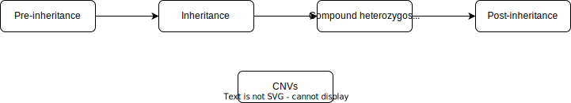

= DDD Clinical Filtering Rules
:icons: font
:source-highlighter: pygments
v1.0 - November 2021

This document describes the rules implemented in our clinical filtering pipeline in order to select candidate variants in the DDD cohort. 

The pipeline is organised in five modules, four dedicated to SNVs and indels, one dedicated exclusively to CNVs.

== 1. Pre-inheritance

=== 1.1 Common variants

==== 1.1.1 Control population

Exclude variants with an allele frequency greater than **0.5%** in _gnomAD_ or _1000 genomes_.

.More
[%collapsible]
====

**Code** +

.load_vcfs.py -> read_vcf
[source,bash]
----
bcftools view -e 'INFO/MAX_AF>0.005'
----

**Infos** +

[NOTE]
======
See https://www.ensembl.org/info/docs/tools/vep/script/vep_options.html[VEP MAX_AF] to see how this field is generated.
======

[NOTE]
======
The gnomAD version used by VEP changes over time.
======

.Why?
[TIP]
======
Common variants are unlikely to be causative for rare developmental disorders.
======

====

==== 1.1.2 DDD

Exclude autosomal variants with an allele frequency greater than **0.5%** in the DDD cohort.

.More
[%collapsible]
====
**Code** +

.preinheritance_filtering.py -> create_variants_per_gene
[source,python]
----
if float(self.variants["child"][v].ddd_af) > 0.005:
	logging.info(v + " failed high DDD AF: " + self.variants["child"][v].ddd_af)
	continue
----

**Infos** +

.Why?
[TIP]
======
Common variants are unlikely to be causative for rare developmental disorders.
======
====

==== 1.1.3 X-linked variants

===== 1.1.3.1 Control population

Exclude X-linked variants with an allele frequency greater than **0.0001%** in _gnomAD_ or _1000 genomes_.

.More
[%collapsible]
====

**Code** +

.preinheritance_filtering.py -> X_maf_filter
[source,python]
----
if float(max_af) > 0.000001:
	logging.info(varid + " failed X chromosome allele " "frequency: gnomad AF = " + str(max_af))
	del variants_per_gene[gn][varid]
----

**Infos** +

.Why?
[TIP]
======
How was the threshold determined ?
======
====

===== 1.1.3.2 DDD fathers

Exclude X-linked variants found in at least one DDD father

.More
[%collapsible]
====

**Code** +

.preinheritance_filtering.py -> X_maf_filter
[source,python]
----
 elif float(ddd_father_af) > 0:
	logging.info(
		varid + " failed X chromosome allele "
		"frequency: DDD unaffected father "
		"AF = " + str(ddd_father_af)
	)
	del variants_per_gene[gn][varid]
----

**Infos** +

.Why?
[TIP]
======
Not sure why
======
====

=== 1.2 Low genotype quality

Exclude autosomal variants with a low genotype quality (GQ < 40).

.More
[%collapsible]
====

**Code** +

.preinheritance_filtering.py -> create_variants_per_gene
[source,python]
----
if int(self.variants["child"][v].gq) < 40 and self.variants["child"][v].chrom not in ["X", "Y"]:
	logging.info(v + " failed low GQ: " + self.variants["child"][v].gq)
	continue
----

**Infos** +

[NOTE]
======
More informations about GQ https://support.illumina.com/content/dam/illumina-support/help/Illumina_DRAGEN_Bio_IT_Platform_v3_7_1000000141465/Content/SW/Informatics/Dragen/QUAL_QD_GQ_Formulation_fDG.htm[here].
======

.Why?
[TIP]
======
Setting a high GQ threshold reduces the number of false positive calls.

GQ=40 means that only 1 in 10,000 calls is expected to be wrong.

How was the threshold chosen? 
======

====

=== 1.3 Functional consequence

Exclude variants with no functional consequence in the following list :

[small]
----
frameshift_variant
missense_variant
splice_donor_variant
splice_acceptor_variant
start_lost
stop_gained
protein_altering_variant
transcript_ablation
transcript_amplification
inframe_insertion
inframe_deletion
stop_lost
----

.More
[%collapsible]
====

**Code** +

.preinheritance_filtering.py -> create_variants_per_gene
[source,python]
----
cqs = self.variants["child"][v].consequence.split("&")
coding_cqs = common_elements(cqs, consequences)
if len(coding_cqs) == 0:
	logging.info(v + " failed, no functional consequences: " + self.variants["child"][v].consequence)
	continue
----

**Infos** +

[NOTE]
======
https://www.ensembl.org/info/genome/variation/prediction/predicted_data.html[List of VEP functional consequences]
======

[TIP]
======
Variants with no functional consequence are unlikely to be causative for rare developmental disorders.
======

====

=== 1.4 REVEL

Exclude missense variants with a low REVEL score (< 0.4).

_Not applied to DNM_

.More
[%collapsible]
====

**Code** +

.preinheritance_filtering.py -> revel_filter
[source,python]
----
if revel < 0.4:
	logging.info(varid + " failed REVEL filter: " + str(revel))
	del variants_per_gene[gn][varid]
----

**Infos** +

[NOTE]
======
REVEL is a method for predicting the pathogenicity of missense variants. It combines pathogenicity predictions from 18 individual scores, including 8 conservation scores and 10 functional scores as described in Ioannidis et al., 2016
======

.Why?
[TIP]
======
Why the 0.4 threshold? Look at article for more informations.
======

====

=== 1.5 Dodgy DNM

Exclude variants not found in the parents but not called as DNM either.

.More
[%collapsible]
====

**Code** +

.preinheritance_filtering.py -> dnms_filter
[source,python]
----
if (childvar.triogenotype == "100" or childvar.triogenotype == "200") and childvar.dnm == False:
	logging.info(varid + " triogenotype = " + childvar.triogenotype + " and failed DNM filter")
	del variants_per_gene[gn][varid]
----

**Infos** +

[NOTE]
======
Putative DNMs are checked using a random forest classifier trained on known DNMs, classifying those variants as true DNMs or not. 
======

.Why?
[TIP]
======
Remove false positive DNMs.
======

====

=== 1.6 DDG2P

Exclude variants not found in a DDG2P gene.

.More
[%collapsible]
====

**Code** +

.inheritance_filtering.py -> inheritance_filter_genes
[source,python]
----
if hgncid in self.genes.keys():
	...
----

**Infos** +

[NOTE]
======
The DDG2P gene-disease associations are taken from the https://www.ebi.ac.uk/gene2phenotype/downloads[EBI website]. Only **definitive**, **strong** and **moderate** associations are considered.
======

.Why?
[TIP]
======
Variants are likely to be found in genes with evidence of a link with developmental disorders.
======

====

== 2. Inheritance

The inheritance module combines the gene-disease association https://www.ebi.ac.uk/gene2phenotype/terminology[allelic requirement], the child's genotype and, in case of trios, the parents'genotypes and affected status, in order to reject or select candidate variants.

=== 2.1 Autosomes

==== 2.1.1 Singletons

==== 2.1.2 Trios

===== 2.1.2.1 Heterozygous variants

===== 2.1.2.2 Homzygous variants

=== 2.2 Allosomes

==== 2.2.1 Singletons

==== 2.2.2 Trios

===== 2.2.2.1 Heterozygous variants

===== 2.1.2.2 Homzygous variants

== 3. CNV

CNV filtering rules are already implemented but not yet described in this document

=== 3.1 Quality

=== 3.2 Large CNVs

=== 3.3 Inheritance

== 4. Compound heterozygous screening

== 5. Post-inheritance

=== 5.1 Allele frequencies

The following filters are applied to single variants found in genes with an allelic requirement different from *Biallelic*

==== 5.1.1 Singletons

Exclude variants with an allele frequency greater than *0.05%* in either the control or DDD population 

.More
[%collapsible]
====

**Code** +

.postinheritance_filter.py -> maf_filter
[source,python]
----
if self.family.has_both_parents() and maximum_af >= 0.0005:
    del self.candidate_variants["single_variants"][v]
----
====

==== 5.1.2 Trios

Exclude variants with an allele frequency greater than *0.01%* in either the control or DDD population 

.More
[%collapsible]
====

**Code** +

.postinheritance_filter.py -> maf_filter
[source,python]
----
elif not self.family.has_both_parents() and maximum_af >= 0.0001:
    del self.candidate_variants["single_variants"][v]
----
====

=== 5.2 gnomAD allele counts

The following filters are applied to single variants using gnomAD allele counts

==== 5.2.1 Monoallelic

Exclude variants with an heterozygous allele count greater than *4* in genes with _Monoallelic_ allelic requirement. 

.More
[%collapsible]
====

**Code** +

.postinheritance_filter.py -> allele_count_filter
[source,python]
----
if self.candidate_variants["single_variants"][v]["mode"] == "Monoallelic":
	if int(self.candidate_variants["single_variants"][v]["variant"].AC_het) > 4:
		del self.candidate_variants["single_variants"][v]
----

**Infos** +

[NOTE]
======
AC_het = AC_XX + AC_XY - 2*(nhomalt_XX + nhomalt_XY)
======

====

==== 5.2.2 Hemizygous

Exclude variants in males with an hemizygous allele count greater than *0* in genes with _Hemizygous_ allelic requirement. 

.More
[%collapsible]
====

**Code** +

.postinheritance_filter.py -> allele_count_filter
[source,python]
----
if (
	self.candidate_variants["single_variants"][v]["mode"] == "Hemizygous"
	and self.candidate_variants["single_variants"][v]["sex"] == "XY"
):
	if int(self.candidate_variants["single_variants"][v]["variant"].AC_hemi) > 0:
		del self.candidate_variants["single_variants"][v]
----

**Infos** +

[NOTE]
======
AC_hemi = nhomalt_XY
======

====

==== 5.2.3 X-linked dominant

Exclude variants with an heterozygous + hemizygous allele count greater than *4* in genes with _X-linked dominant_ allelic requirement. 

.More
[%collapsible]
====

**Code** +

.postinheritance_filter.py -> allele_count_filter
[source,python]
----
if self.candidate_variants["single_variants"][v]["mode"] == "X-linked dominant":
	AC_total = int(self.candidate_variants["single_variants"][v]["variant"].AC_het) + int(
		self.candidate_variants["single_variants"][v]["variant"].AC_hemi
	)
	if AC_total > 4:
		del self.candidate_variants["single_variants"][v]
----

====

== Revision History

[cols="3,3,3,3"]
|===
| Version | Date       | Author         | Description
| 0.1     | 2024-02-08 | Erwan Delage    | Initial version of the document.
|===

